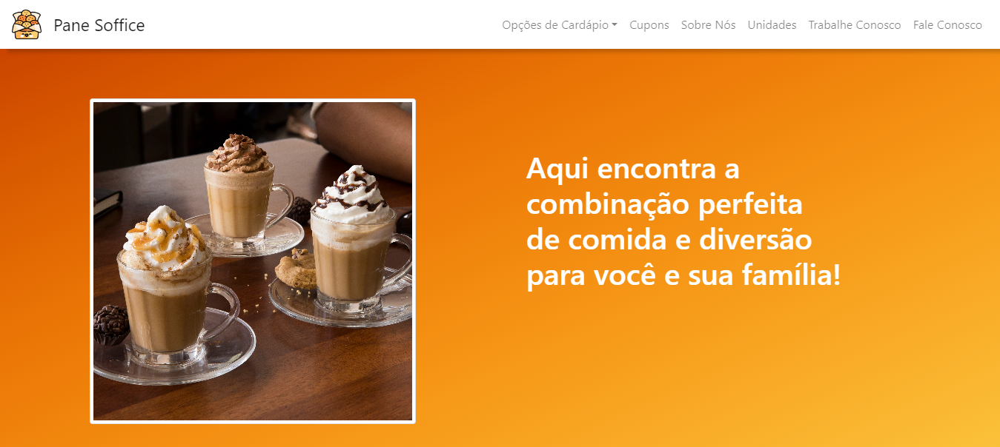

# Pane Soffice - Site de Simulação de Compra Online de uma Padaria

Bem-vindo ao repositório do Pane Soffice! Este projeto tem como objetivo simular a experiência de compra online de uma padaria, oferecendo opções de cardápio, formulário de entrega, páginas de cupons e informações de contato. O site está em desenvolvimento e utiliza as linguagens PHP, HTML e CSS.

## Objetivo do Projeto

O Panés Office visa proporcionar uma experiência de compra online conveniente e fácil para os clientes de uma padaria. As principais funcionalidades incluem:

- **Cardápio Online:** Os clientes podem visualizar uma variedade de produtos disponíveis para compra, como pães, bolos, doces, salgados, entre outros.
- **Formulário de Entrega:** Após selecionar os itens desejados, os clientes podem preencher um formulário com detalhes de entrega, como endereço e horário desejado.
- **Páginas de Cupons:** Oferece cupons de desconto especiais para incentivar os clientes a fazerem pedidos online.
- **Trabalhe Conosco:** Página dedicada a informações sobre oportunidades de emprego na padaria.
- **Fale Conosco:** Os clientes podem entrar em contato com a padaria para fazer perguntas, dar feedback ou relatar problemas.

## Tecnologias Utilizadas

O projeto é desenvolvido utilizando as seguintes tecnologias:

- **PHP:** Linguagem de programação server-side para a lógica de negócios e manipulação de dados.
- **HTML:** Linguagem de marcação para estruturar o conteúdo das páginas web.
- **CSS:** Utilizado para estilização e design das páginas do site.

## Imagem do Projeto

## Acesso ao Projeto

Você pode acessar o site do projeto [aqui](https://anayukimoto.github.io/panesoffice.github.io/).

